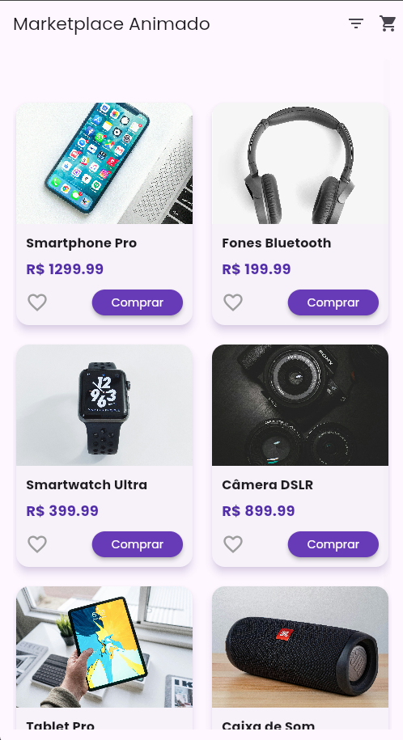
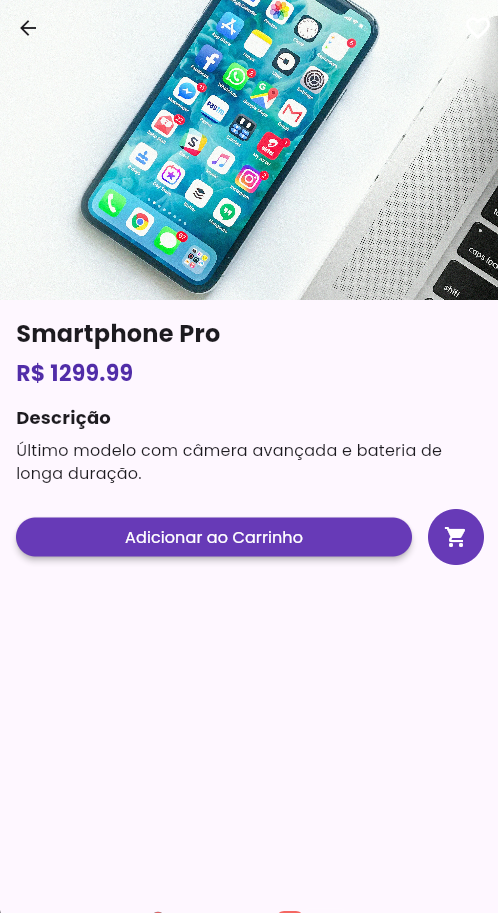
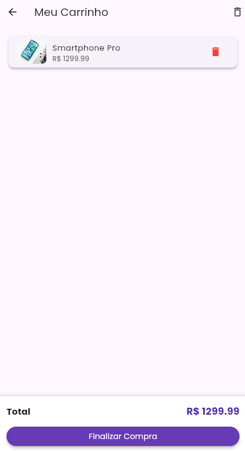

# Marketplace Animado

[](https://flutter.dev)
[](https://dart.dev)
[](https://opensource.org/licenses/MIT)

Um marketplace animado e interativo desenvolvido em Flutter, com foco em experiência do usuário, animações fluidas e código limpo. Ideal para demonstrar habilidades em desenvolvimento mobile para recrutadores.

## 📱 Demonstração

### Screenshots

| Tela Principal | Detalhes do Produto | Carrinho |
|----------------|---------------------|----------|
|  |  |  |


## ✨ Funcionalidades

### 🛍️ Marketplace Completo
- **Catálogo de Produtos**: Exibição em grid assimétrico com animações de entrada
- **Detalhes do Produto**: Hero animations e transições suaves
- **Carrinho de Compras**: Gerenciamento completo com animações
- **Favoritos**: Sistema de favoritos com animações de coração

### 🎨 UI/UX Sofisticada
- **Animações Fluidas**: Micro-interações em todos os elementos
- **Design Responsivo**: Adaptável para diferentes tamanhos de tela
- **Temas Coerentes**: Paleta de cores unificada e tipografia consistente
- **Feedback Visual**: Animações para todas as ações do usuário

### 🚀 Performance Otimizada
- **State Management**: Riverpod para gerenciamento de estado eficiente
- **Cache Offline**: Hive para persistência local rápida
- **Carregamento Lazy**: Carregamento sob demanda de imagens e dados
- **Otimização de Renderização**: Uso de const widgets e RepaintBoundary

### 💾 Persistência de Dados
- **Offline-First**: Funcionalidade completa mesmo sem internet
- **Sincronização**: Pronto para integração com backend (Firebase)
- **Cache Inteligente**: Armazenamento local de favoritos e carrinho

## 🛠️ Tecnologias Utilizadas

- **Flutter**: Framework principal para desenvolvimento multiplataforma
- **Dart**: Linguagem de programação
- **Riverpod**: Gerenciamento de estado
- **Hive**: Banco de dados local NoSQL
- **Flutter Staggered Grid View**: Layout de grid assimétrico
- **Cached Network Image**: Cache eficiente de imagens da web

## 📦 Estrutura do Projeto

```
lib/
├── models/                 # Modelos de dados
│   └── product_model.dart
├── providers/              # Gerenciadores de estado
│   ├── cart_provider.dart
│   ├── favorites_provider.dart
│   └── product_provider.dart
├── screens/                # Telas do aplicativo
│   ├── cart_screen.dart
│   ├── filter_screen.dart
│   ├── home_screen.dart
│   └── product_detail_screen.dart
├── widgets/                # Widgets reutilizáveis
│   ├── heart_animated_icon.dart
│   └── product_card.dart
├── main.dart              # Ponto de entrada
└── utils/                 # Utilitários (se necessário)
```

## 🚀 Como Executar o Projeto

### Pré-requisitos
- Flutter SDK: >=3.0.0
- Dart SDK: >=3.0.0
- IDE: VS Code, Android Studio ou IntelliJ

### Passos

1. **Clone o repositório**
   ```bash
   git clone https://github.com/ryanpichiteli/marketplace-animado.git
   cd marketplace-animado
   ```

2. **Instale as dependências**
   ```bash
   flutter pub get
   ```


3. **Execute o aplicativo**
   ```bash
   flutter run
   ```

### Para desenvolvimento

```bash
flutter run --debug
```

### Para build de release

```bash
flutter build apk --release
```

## 🧪 Testes

O projeto inclui testes unitários e de widgets para garantir a qualidade do código:

```bash
flutter test
```

## 📝 Licença

Este projeto está licenciado sob a Licença MIT - veja o arquivo [LICENSE](LICENSE) para detalhes.


## 📞 Contato

Ryan Pichiteli - [@ryanoutk](https://www.instagram.com/ryanoutk/) - ryanpichiteli@icloud.com

Link do Projeto: [https://github.com/ryanpichiteli/marketplace-animado](https://github.com/ryanpichiteli/marketplace-animado)

## 🙏 Agradecimentos

- [Flutter](https://flutter.dev) pela incrível framework
- [Riverpod](https://riverpod.dev) pelo gerenciamento de estado eficiente
- [Hive](https://hive.flutter.dev) pela solução de persistência local
- [Unsplash](https://unsplash.com) pelas imagens de alta qualidade

---

⭐️ Se este projeto foi útil para você, por favor, deixe uma estrela!
